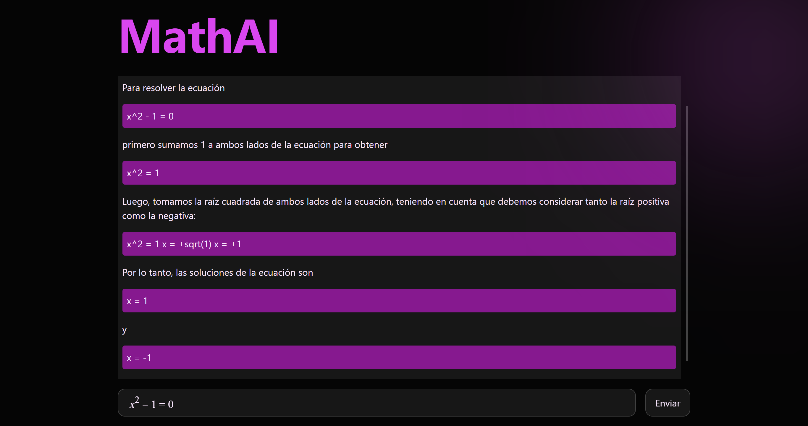

# Math AI

Resuelve **problemas matemáticos** con **inteligencia artificial**. Ingresa tu problema matemático y recibe una solución detallada.

👉 Enlace: [https://mathai.vercel.app/](https://mathai.vercel.app/)

  
  
  
  
  
  
  
  
  

# Instalación y uso 🎖️

**¡Código abierto al mundo!**

-   Puedes utilizar el producto realizando un `git clone https://github.com/jevmydev/mathai` en tu terminal.
-   Crear el archivo `.env.local` en la raíz del proyecto.
-   Después, crear: `VITE_OPENAI_APIKEY` (Revisa `https://platform.openai.com/docs/quickstart/build-your-application`).
-   Luego emplear `pnpm run dev` en tu terminal para desplegar un entorno de desarrollo en la web.

También dispones de:

-   `pnpm run build`: Empaquetar los módulos y construir un distribuible.
-   `pnpm run preview`: Despliege de un entorno de preview del distribuible.
-   `pnpm run lint`: Ejecutar eslint y arreglar los errores en el código.
-   `pnpm run format`: Ejecutar prettier y formatear el código.
